 

  

 

  

  <b>`> SYSTEM_PROFILE.exe`</b>
  <samp>
       
      Hi there! I'm <b>Matheus Soares Rothje</b>
  </samp>

  

 

  
  

 
 

  
  
  
  
  
  

 

  

 

  
  
  

 
 

  

      <samp>
        <b>More Info</b>
      </samp>
  

 

##

 

  <picture>
    <source media="(prefers-color-scheme: dark)" srcset="./dark.svg">
    <source media="(prefers-color-scheme: light)" srcset="./light.svg">
    
  </picture>

 

  <samp>
    <b>
      // POR QUE CONTRATAR
    </b>
  </samp>
    
  <samp>
    &gt; Foco em resolver problemas reais 
    &gt; Expert em automações Python 
    &gt; Aprende rápido, evolui sempre 
    &gt; Ideia -&gt; produto funcional, de verdade 
    &gt; Comprometido com qualidade e prazos
  </samp>

 

  <samp>
    <b>
      // LOG DE SISTEMA
    </b>
  </samp>
    
  <samp>
    Dev Full Stack com foco em Python e automações — movido a cafeína e boas 
    ideias. Programar é criar algo do zero: transformar uma ideia em algo 
    funcional e útil é o que me motiva todos os dias. Hoje me aprofundo nas 
    áreas que mais admiro, aprendendo na teoria e na prática. Objetivo: chegar 
    longe, construir uma vida com propósito e deixar minhas ideias pelo mundo.
  </samp>

 

  <samp>
    <b>
      Contact me:
    </b>
  </samp>
   
   

  
  

 

##

 

  

 

  
  

 

  

 

  

 

